## Opening Question

Let's say you wrote a research paper and your laptop died. How long would it take you to reproduce your analyses and results (figures, tables, and overviews) with a new laptop?

1.  Less than one hour (easy!)

2.  Between one hour and a day (It's possible but painful)

3.  More than one day (I'd be stuck)

## Why should YOU care about reproducible research?

\centering

Storing data, code, and analyses can quickly turn into a mess:

\begin{center}
\includegraphics[width =0.6\textwidth]{"images/pic2.png"} \\
\end{center}

## Why should YOU care about reproducible research?

\begin{center}
Story Time!
\bigbreak
\includegraphics[width =0.50\textwidth]{"images/figure3.jpg"} \\
\end{center}

## But there is more at stake!

\centering

In 2019, *Management Science* introduced a Data and Code Disclosure Policy:

*"Authors of accepted papers… must provide… the data, programs, and other details of the experiment and computations sufficient to permit replication."*

A 2024 study examined nearly 500 articles published before and after this policy was introduced to see if the results could, in fact, be reproduced [@FGHKO_2024].

**What share of these articles do you think were largely reproducible?**

## But there is more at stake!

\begin{center}
\includegraphics[width =0.70\textwidth]{"images/figure6.png"} \\
\end{center}

\centering
\small
Before (after) the 2019 disclosure policy, 6.6% (67.5%) of articles were reproducible.
Under the policy and for verifiable articles, 95.3% was reproducible!

## But there is more at stake!

\begin{center}
\includegraphics[width =0.70\textwidth]{"images/figure2.png"} \\
\end{center}

\centering
\small

Considerable heterogeneity reproducibility across fields, mostly due to size, method, and data availability.

## More recent evidence

\begin{center}
\includegraphics[width =0.35\textwidth]{"images/figure7.png"} \\
\end{center}

\centering
\small

Over 85% of articles in economics and political science journals with sharing policies were reproducible. 72% of significant estimates stay significant and same-signed [@Brodeur_2026].

## But there is more at stake!

\centering

-   Even when mandating verifiable research pipelines, roughly 15% to 33% of articles fails the reproducibility test.
-   This is why a structured and sharable research pipeline is not only a formality or a “nice to have.”
-   It’s essential for credible research and for us to trust the insights it produces.
-   It also does not only rest on professor's shoulders. It all starts with:

\begin{center}
\includegraphics[width =0.20\textwidth]{"images/you.png"} \\
\end{center}

## The main goals of this session:

-   Sharing a few basic principles, techniques, and tools. Inspired by:
    -   [**Code and Data for the Social Sciences** (Gentzkow and Shapiro)](https://web.stanford.edu/~gentzkow/research/CodeAndData.pdf)
    -   [**How to keep your research projects organized** (de Kok)](https://medium.com/data-science/how-to-keep-your-research-projects-organized-part-1-folder-structure-10bd56034d3a)
    -   [**Good Enough Practices in Scientific Computing** (Wilson et al.)](https://journals.plos.org/ploscompbiol/article?id=10.1371/journal.pcbi.1005510)
    -   [**The TIER Protocol** (Project Tier)](https://www.projecttier.org/tier-protocol/protocol-4-0/)
-   Let's make this interactive: Please interrupt, ask questions, and tell me about your experience.
-   Disclaimer: Largely through the lens of a quantitative researcher.
-   All materials for this talk are available: [**Example Repository**](https://github.com/victorvanpelt/research_pipeline_example) and [**These Slides**](https://github.com/victorvanpelt/research_pipeline_slidedeck)

## What will we cover in this session?

1.  Directory structure: How to organize your research project

2.  Version control: Using Git and repositories (example using GitHub)

3.  Integrating multiple languages: Example using Quarto

4.  Some comments on AI in the research pipeline

# 1. Directory Structure

## What are the fundamental principles for reproducible research?

**Universal research principles:**

-   Anyone can run the code anywhere and anytime, regardless of location.
-   Anyone can understand the code and data without much effort.
-   Anyone can change one number or one step and rerun, with no hardcoded values.

## The key is to design and structure your process

-   Use a flow-inspired directory structure:
    -   E.g., formatting files -\> generating variables -\> conducting analyses -\> generating output.
-   Leave the raw data untouched: You load it and use it to produce output:
    -   E.g., raw data files -\> input files -\> process files -\> output files.
-   Use relative paths (e.g., "*../0_data/data.csv*") and not direct paths (e.g., "*C:/user\[name\]/Documents/research/project_1/0_data/data.csv*").

\highlightbox{Anyone should be able to delete everything except the raw data and the code, and rebuild your whole project.}

## Use coding, so others can use and run it

-   Make your code deterministic: set a seed for random and stochastic processes.
-   Pin your environment: "*version*" in Stata, *renv* in R.
-   Use plenty of comments to explain what the code is doing.
-   Be as descriptive as you can in folder and file names; avoid special characters.
-   Prefer tool-agnostic file formats: a "*.csv*" opens anywhere, for anyone.
-   Use environment variables for credentials and software paths.

\highlightbox{Write for the stranger who inherits the project, because in a few years that stranger is you.}

## A simple starting point for a directory structure

\begin{center}
\includegraphics[width =0.75\textwidth]{"images/figure4.png"}
\end{center}

## Additional folders and extensions

\begin{center}
\includegraphics[width =0.75\textwidth]{"images/figure5.png"}
\end{center}

## An example directory for you to use

\centering

Let's take a closer look at how this works in practice (using Stata, R, and Quarto):

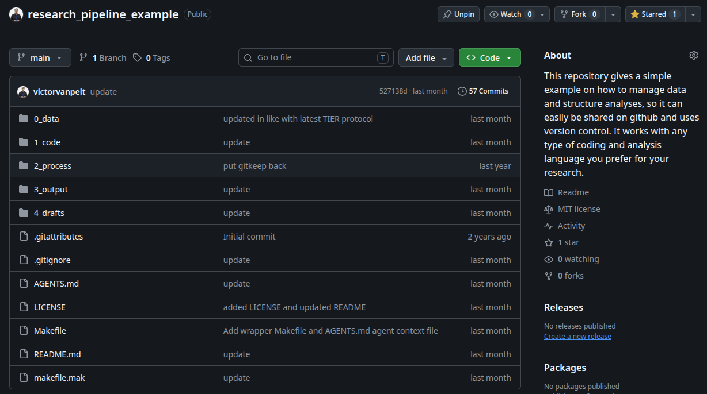{width="285"}

\small

[**Click here to use this repository!**](https://github.com/victorvanpelt/research_pipeline_example)

## Detailed overview of the example directory

\tiny
\centering
```
research_pipeline_example/
├── 0_data/                        raw inputs (real raw data is NOT shared)
│   ├── gen_ai_earnings.csv        small synthetic dataset so the example runs
│   └── codebook.md                what each variable means and its type
├── 1_code/                        analysis code (shared; the heart of the repo)
│   ├── code.do                    Stata
│   ├── code.r                     R
│   └── code.qmd                   Quarto version of the R code
├── 2_process/                     intermediate / passing data between steps (NOT shared)
├── 3_output/                      shared outputs: tables and figures
│   ├── table_1.tex                written by the analysis, read by the drafts
│   └── data_appendix/             stats and figures for the data appendix
├── 4_drafts/                      the documents; each .qmd renders to a committed .pdf
│   ├── paper.qmd             	   the manuscript
│   ├── presentation.qmd   		   the slides
│   ├── data_appendix.qmd		   the data appendix (describes the analysis data)
│   ├── references.bib             bibliography for the drafts
│   └── materials/                 beamer theme, logo, fonts for the slides
├── makefile.mak                   build tasks (the pipeline)
├── Makefile                       two-line wrapper including makefile.mak
├── AGENTS.md                      rules for AI coding agents working in this repo
├── .gitignore                     what is and is not version-controlled
└── .gitattributes   			   normalizes line endings across operating systems
```

## 0_data: codebook.md

\centering

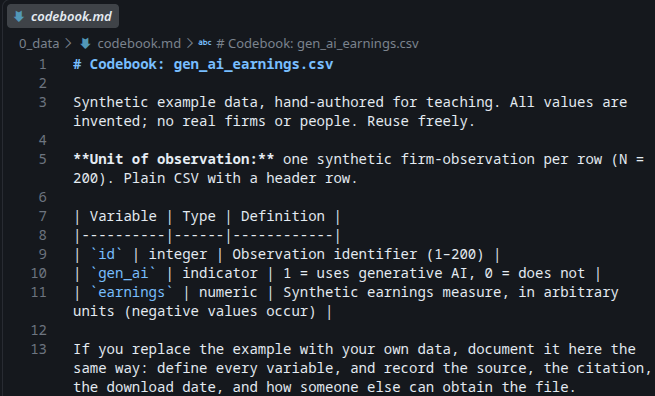{height="195"}

0_data/codebook.md lists what each variable in the raw data means and its type

## 1_code: Stata do-file (same analysis in code.r and code.qmd)

\centering

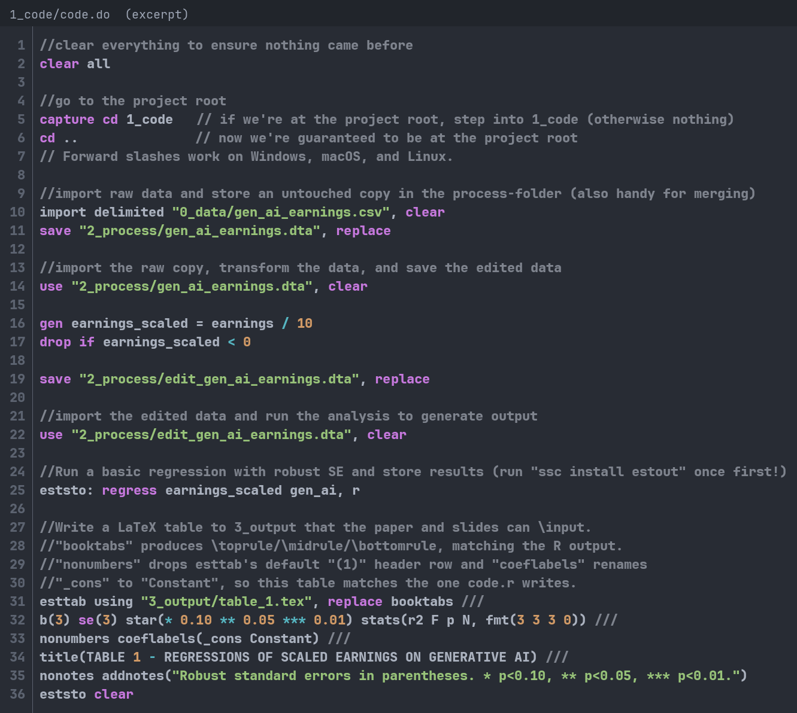{height="225"}

## 3_output: Table 1 - Regression of Scales Earnings on Generative AI

\centering

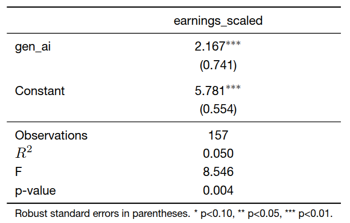{height="225"}

## How do you currently run analyses and produce results?

1.  A code file run by hand in the right order

2.  Point and click, from memory

3.  Ask AI to produce results for me

4.  Other

## A structured pipeline allows you to use makefiles!

\centering

A makefile states which outputs depend on which code and data, and how to rebuild them 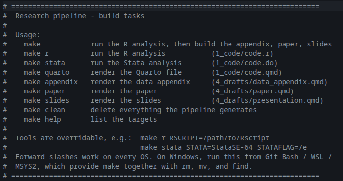{fig-align="center" height="175"}

## makefile.mak in root

\centering

You run "*make*" in the CLI to rebuild everything, or a single step with "*make r*", "*make stata*", "*make quarto*", "*make appendix*", "*make paper*", or "*make slides*" 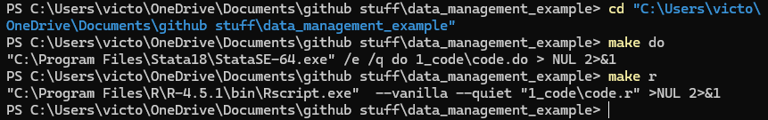{fig-align="center" height="75"}

## Is your code slow?

-   Does your code:
    -   Take a long time to run?
    -   Require too much memory?
-   Ask your supervisor for a better laptop.
-   Otherwise, consider looking into running your code remotely:
    -   A "supercomputer," "grid," or "server" is more powerful.
    -   Ask about your school's research computing services.

# 2. Version Control

## Opening question:

\centering

**Whose folders look something like this?**

\begin{center}
\includegraphics[width =0.3\textwidth]{"images/pic1.png"} \\
\end{center}

## What is version control?

\centering

Version control is a system that records changes to a file or set of files over time so that you can recall specific versions later.

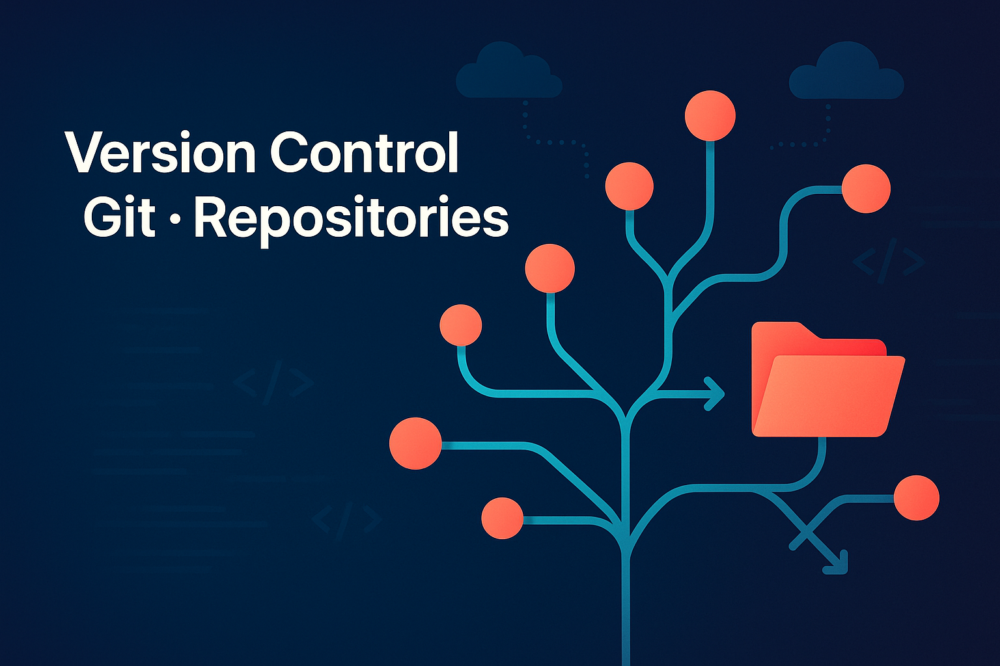{fig-align="center" height="175"}

## How do I use version control?

-   Many cloud services have some forms of version control (e.g., Dropbox and OneDrive), but they can be unreliable and do not trace your work process properly.
-   The most widely used software is called [**git**](https://git-scm.com/)
-   You can run [**git**](https://git-scm.com/) locally using the command line (CLI), but it is easier to use an online provider to do everything for you.
-   Saving your version control in the cloud reduces the likelihood you lose stuff, and allows you to document and track your work process properly.
-   Three major [**git**](https://git-scm.com/) providers:
    -   [GitHub](https://github.com) --\> The best choice!
    -   Bitbucket
    -   GitLab

## What is GitHub?

-   GitHub hosts your working directory (a.k.a. your git repositories or "repos") online and adds collaboration tools around them.
-   Why use it?
    -   Clean and easy-to-use interface
    -   Works with any language and file type
    -   GitHub Desktop application is very simple and convenient
-   Bonus feature: you can use GitHub Pages to host your website for free! See mine [**www.victorvanpelt.com**](https://www.victorvanpelt.com)

## GitHub Education

\centering

As a verified student, you get GitHub Pro and the Student Developer Pack for free [**here**](https://education.github.com/pack). {fig-align="center" height="225"}

## Download GitHub Desktop

\centering

Download GitHub Desktop for Windows or macOS [**here**](https://desktop.github.com/download/). 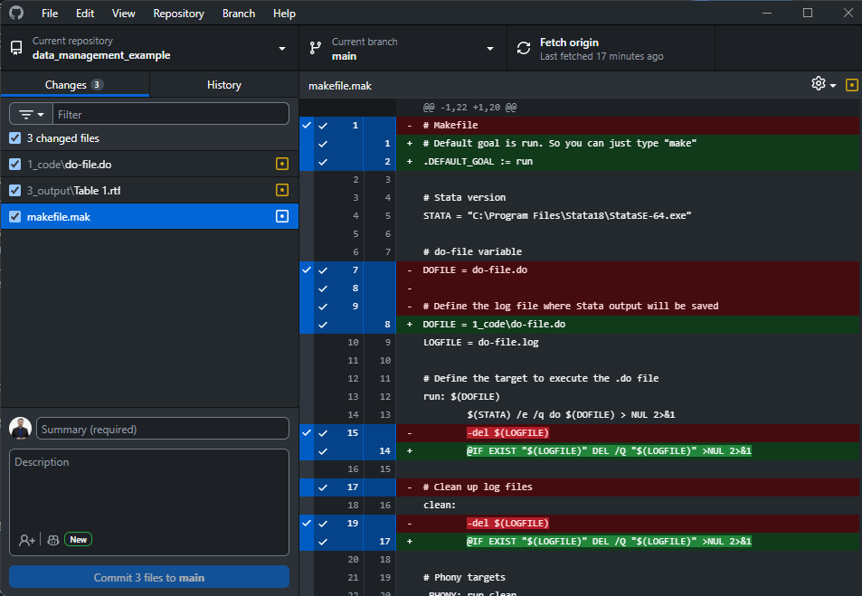{fig-align="center" height="200"}

## What is the basic workflow with GitHub?

-   First time:
    -   Create a new repository using GitHub
    -   Clone it to your computer or Publish it using GitHub Desktop
-   When you start working:
    -   Sync with GitHub first: "Pull" changes
-   After making changes:
    -   Sync with GitHub first: "Pull" changes
    -   Create commit (add summary and descriptions)
    -   Push commit to GitHub.
-   Use a README.md file to state the project's title and a brief description of the repository.

## .gitignore files

-   There are lots of things you might not want to sync with GitHub
    1.  Private or non-public data
    2.  Personal credentials
    3.  "Byproduct" files that aren't critical to the repo
-   Think carefully about what you sync with GitHub.
-   A .gitignore file allows you to select files that should automatically be ignored by git.

## .gitignore syntax

-   The basic syntax can be found [**here**](https://git-scm.com/docs/gitignore)**.**
-   Some common expressions:
    -   \# -\> comment
    -   \* -\> any file
    -   / at the end -\> folder
    -   ! -\> keep (don’t ignore)

## .gitignore example

\centering

The example repository ignores everything by default, then allows back what should be shared: the safest default for private data 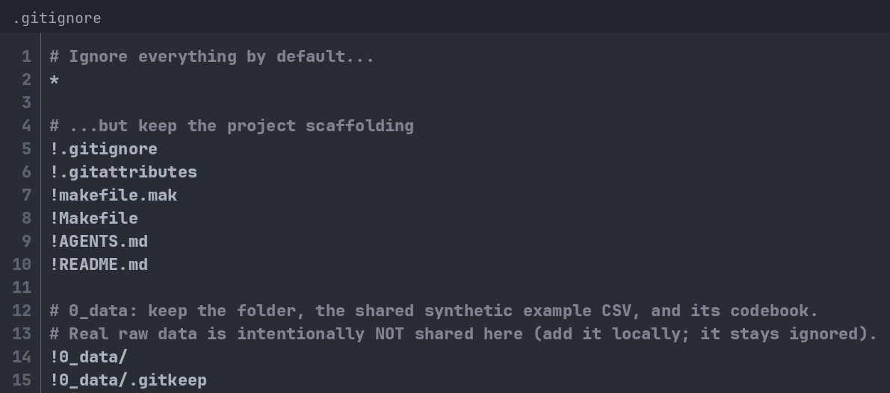{fig-align="center" height="175"}

## Why should you care?

-   Remember my anecdote at the start: 
    -   You need to be able to go back to any version at any time.
-   Journals and institutions require access to your research materials (i.e., code, instrument, and data).
-   At the very least, they want to ensure it exists.
-   At the very most, they might check your code:
    -   *Management Science* has verified reproducibility since 2019, partly through a third-party agency.
-   Version control plus the directory structure earlier makes compliance nearly free.

# 3. Integrating Multiple Languages

## What's a remaining challenge?

::::: columns
::: {.column width="40%"}
{width="200"}
:::

::: {.column width="60%"}
-   Right now, you already have:
    1.  A good directory structure
    2.  Version control.
-   A remaining challenge is that we use different software, coding languages, and files.
    -   Python, R, Markdown, HTML, Office, Stata, LaTeX, etc.
    -   Tables, datasets, code, and docs.
-   There have been efforts over the past decade to put all processes under one umbrella.
-   One system can integrate nearly everything into one process: Quarto.
:::
:::::

## What is Quarto?

-   Quarto is an open-source scientific and technical publishing system
-   Quarto is not only used for data. It can use data to produce a wide variety of outputs:
    -   Articles and papers
    -   Presentations (this presentation is made using Quarto)
    -   Dashboards
    -   Websites
-   Runs R (Knitr), Python and Julia (Jupyter), and Observable JS next to Markdown and LaTeX.
-   Quarto 2 (late 2026) stays backward compatible; your .qmd files keep working.

## How to get started?

Setup:

1.  Install Quarto from the website: [**https://quarto.org/docs/get-started/**](https://quarto.org/docs/get-started/){.uri}.
2.  Choose an IDE or coding environment (I recommend [**VS Code**](https://quarto.org/docs/get-started/hello/vscode.html)).
3.  Install the [**Quarto VS Code Extension**](https://marketplace.visualstudio.com/items?itemName=quarto.quarto) in VS Code.

Usage:

-   Quarto uses .qmd files. Check the [**guide**](https://quarto.org/docs/guide/).
-   You can produce output in formats, such as .pptx, .docx, .pdf and integrate R and Stata code.
-   The example repository uses Quarto to render a paper, a presentation, and a data appendix ("*4_drafts/*") that pull their numbers and tables straight from the pipeline.
-   It also contains a self-contained literate report ("*1_code/code.qmd*").

## Quarto Presentation Example

\begin{figure}[h!]
    \centering
    \begin{subfigure}[b]{0.3\textwidth}
        \centering
        \includegraphics[width=\textwidth]{images/pic4.png}
        \caption*{Specify in the "YAML" the type of qmd file}
    \end{subfigure}
    \hspace{0.05\textwidth}
    \begin{subfigure}[b]{0.4\textwidth}
        \centering
        \includegraphics[width=\textwidth]{images/pic3.png}
        \caption*{Use R as you would in code.r}
    \end{subfigure}
    \caption*{}
\end{figure}

## Quarto Presentation Example

\begin{figure}[h!]
    \centering
    \begin{subfigure}[b]{0.42\textwidth}
        \centering
        \includegraphics[width=\textwidth]{images/paste-17.png}
    \end{subfigure}
    \hspace{0.05\textwidth}
    \begin{subfigure}[b]{0.42\textwidth}
        \centering
        \includegraphics[width=\textwidth]{images/paste-18.png}
    \end{subfigure}
    \caption*{}
\end{figure}

\highlightbox{One pipeline, three outputs (report, paper, slides), and the numbers always in sync.}

## makefile.mak extension

\centering

"*make appendix*", "*make paper*", and "*make slides*" render the Quarto drafts from the pipeline's output; "*make quarto*" renders the self-contained report

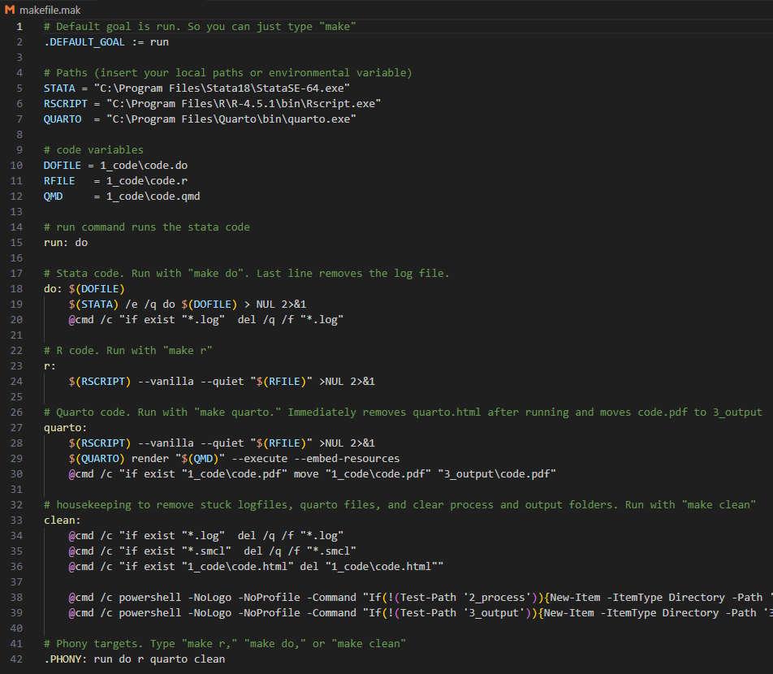{fig-align="center" height="155"}

# 4. AI in your research pipeline

## How will AI affect the research pipeline and reproducibility?

\centering
\large
Somewhere around 15-33% of articles in journals with mandatory sharing policies cannot be reproduced.

**Question: How will AI affect reproducibility?**

## AI can hurt, if you over-delegate

```{=latex}
          \centering  
          \textbf{Consider this spectrum:}
          \process{audit,improvement,generation,full delegation}
          \vspace{1em}
          Where does AI assistance end and replacement begin for you?\\
```

## Examples of over-delegating research to AI

-   A dataset, table, or coefficient directly generated by AI
-   Submitting confidential or licensed data to AI providers
    -   Sometimes you can't even use local llms!
-   Direct edits to raw data, processing files, or output files
-   Invented numbers and code that make no sense

## When AI takes over, research steps can be lost

-   Raw data should stay untouched in "*0_data*", while "*2_processing*" and "*3_output*" are only generated by files in "*1_code*".
-   Once AI cleans, codes, merges, or edits a data file, we cannot directly trace what it did
-   So, we don't want AI to directly touch anything, except what's in "*1_code*".
-   What if AI generates data, like creating or structuring a variable?
    -   If AI generates data, it should be treated as input, like the data in "*0_data*".

## Ok, but what **CAN** AI do for us?

::::: columns
::: {.column width="50%"}
-   Everything we need:
    -   data cleaning, structuring, and merging 
    -   analyses and the production of tables and figures
    -   reporting statistics in papers and slide decks.
-   You must always check what changed and stay in control
-   You also stay in the loop through relevant gates.
:::

::: {.column width="50%"}
{fig-align="center" height="185"}
:::
:::::

\centering

As long as we can trace the research process, we can be responsible

## How can we ensure agents follow such rules?

\centering
\small
In the engineering space, it is common to integrate AI tooling directly in repo's.
But AI changes rapidly and everyone wants to bring their tooling or not at all:

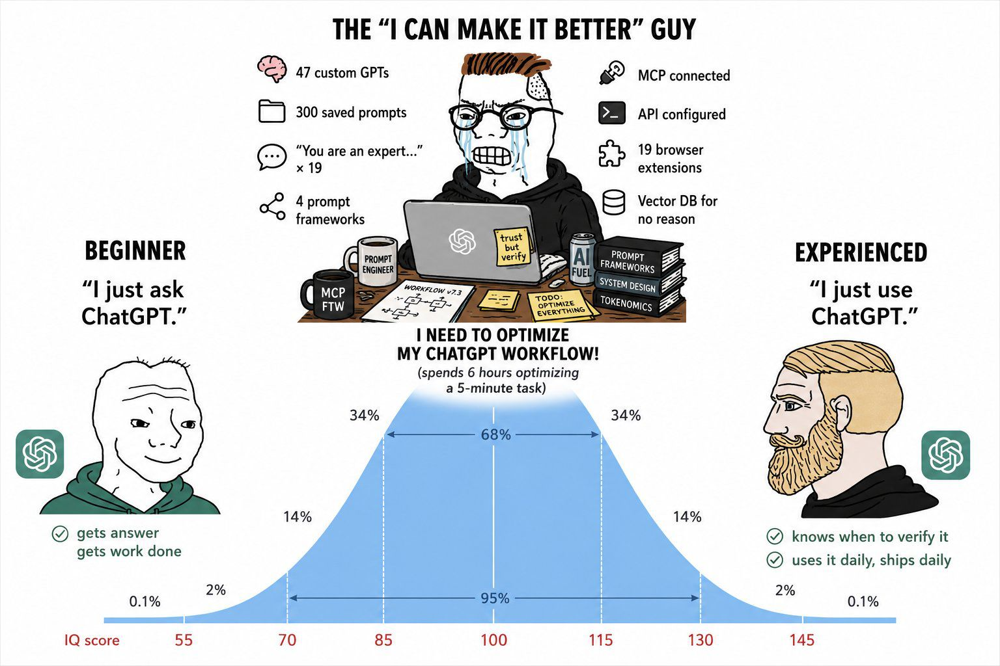{fig-align="center" height="185"}

## My suggestion: A shared rulebook (e.g., AGENTS.md)

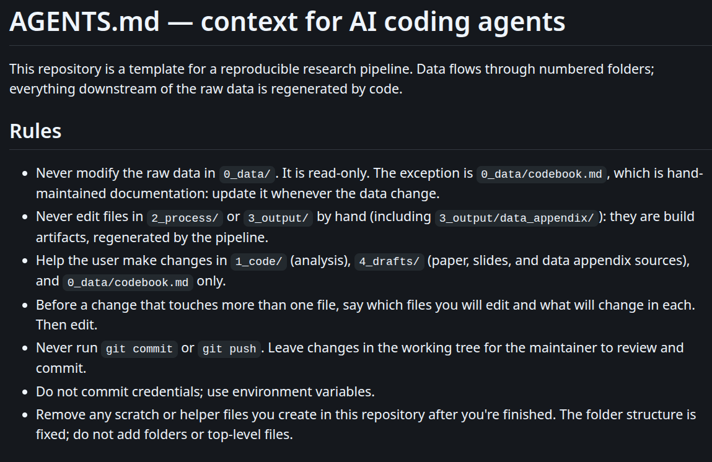{fig-align="center" height="225"}

## How does this work?

**Example:**  

-   Prompt: winsorize scaled earnings at 1st/99th percentile
-   The agent edits "*1_code/code.r*" and reproduces everything with *make*
-   You check the difference in the GitHub app before accepting the change
    -   Check: only "*1_code*" touched, and the step sits before the regression
    -   Check: "*0_data*" and "*3_output*" untouched?
    -   Check: did the results change the way you expected?
-   You commit and push the change

## Summary and Wrap-up

-   Reproducibility has been under threat [@OSC_2015; @B_2016; @CDF_2016; @HLL_2020; @FGHKO_2024;@Brodeur_2026]
-   A research pipeline is vital to ensure results are reproducible.
-   You, as WHU doctoral students, are vital:
    1.  Maintain a good directory structure
    2.  Use version control
    3.  Integrate multiple languages (try Quarto)
    4.  Let AI help you code not take over the research
-   If you don't want to do it for science, then do it to save yourself lots of time and headache.

\centering

[**Download Example Research Pipeline**](https://github.com/victorvanpelt/research_pipeline_example)  
[**Download Slides**](https://github.com/victorvanpelt/research_pipeline_slidedeck)

## A research pipeline is just the start...

-   Ideally, we also need:
    -   Research material sharing (data, instruments, and code)
    -   Pre-registration
-   My recommendation is to try:
    -   [**AsPredicted**](https://aspredicted.org/)
    -   [**AsCollected**](https://ascollected.org/)
    -   [**ResearchBox**](https://researchbox.org/)
-   To faciliate replication: [**README Template**](https://social-science-data-editors.github.io/template_README/)

## Thank you!

\begin{wrapfigure}{r}{0.37\textwidth}
  \vspace{-0.5cm}
  \includegraphics[width=0.41\textwidth]{"images/profile.png"}
\end{wrapfigure}

Dr. Victor van Pelt\
Professor of Behavioral Accounting\
Finance and Accounting Group\
WHU – Otto Beisheim School of Management

Campus Vallendar, Burgplatz 2, 56179 Vallendar, Germany\
Tel.: +49 (0)261 6509 483\
[**Victor.vanPelt\@whu.edu**](mailto:Victor.vanPelt@whu.edu)\
[**https://www.victorvanpelt.com**](https://www.victorvanpelt.com){.uri}

## References {.allowframebreaks}

\scriptsize
